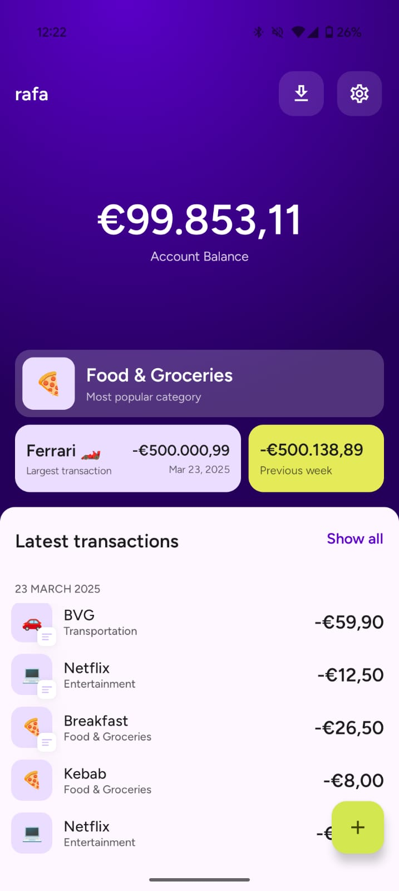
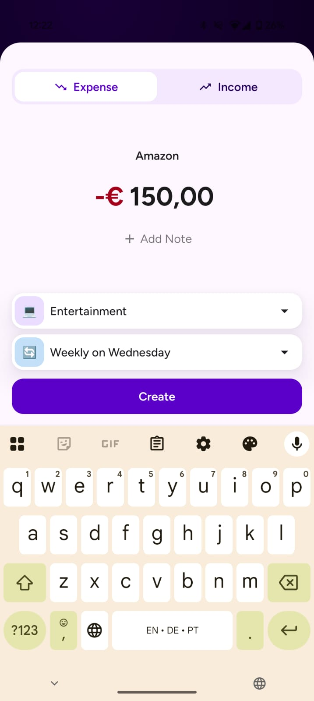
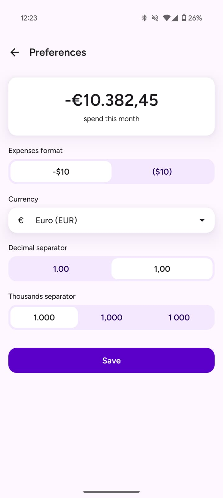
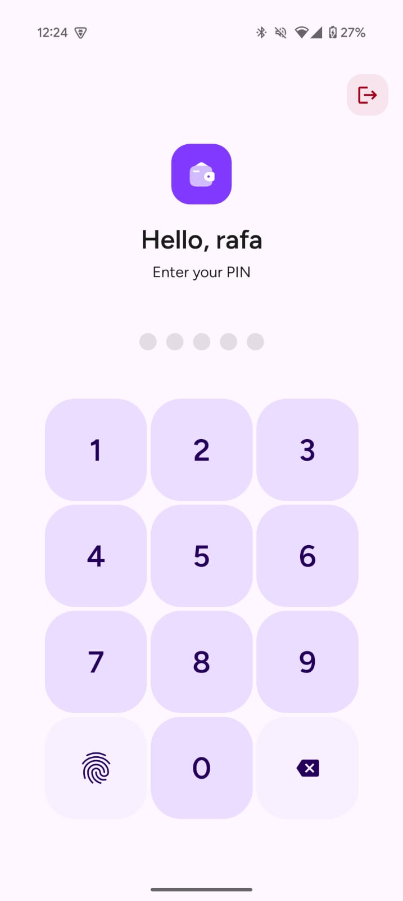
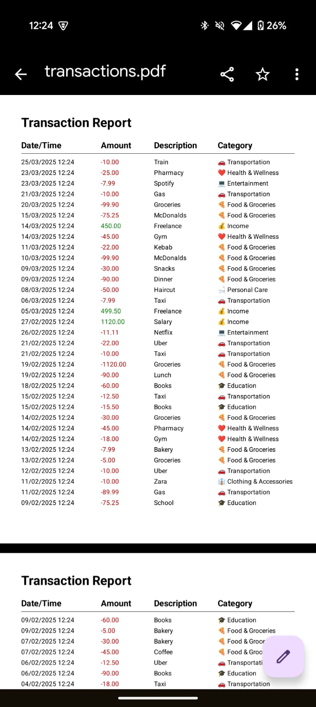

# SpendLess

SpendLess is a finance tracking app with a focus on security. The aim is to keep track of the 
users income and expenses while also securing the data in terms of accessing the app and storing data.

## Screenshots

<table style="border: none">
  <tr>
    <td></td>
    <td></td>
    <td></td>
    <td></td>
    <td></td>
  </tr>
  <tr>
    <td align="center">Dashboard</td>
    <td align="center">Add Expense</td>
    <td align="center">Preferences</td>
    <td align="center">Pin</td>
    <td align="center">Report</td>
  </tr>
</table>

## Features

- **Biometric Authentication**: Users can use their fingerprint or face to unlock the app.
- **Income and Expense Tracking**: Users can add their income and expenses with recurring support.
- **Reports**: Users can export reports in CSV or PDF format.
- **Widget**: Users can add a widget to their home screen to quickly add an expense.
- **Security Preferences**: Users can set up security preferences with session expiration and lockout duration.
- **Expense preferences**: Users can set up expense preferences to view their expenses in a certain way.

## Technical Stack

- **Language**: Kotlin
- **Architecture**: Clean Architecture with MVVM
- **Dependency Injection**: Hilt
- **Database**: Room
- **UI Framework**: Jetpack Compose
- **Background Processing**: WorkManager
- **Testing**: JUnit5

## Getting Started

### Prerequisites

- Android Studio Hedgehog (2023.1.1) or newer
- JDK 17 or newer
- Android SDK 34 or newer

### Installation

1. Clone the repository:
```bash
   git clone git@github.com:rribeiro1/spendless-android.git
```

2. Open the project in Android Studio

3. Sync the project with Gradle files

4. Run the app on your device or emulator

## Building the Project

The project uses Gradle for building. To build the project:

```bash
./gradlew build
```

To create a release APK:

```bash
./gradlew assembleRelease
```

## License

See [LICENSE](LICENSE) file for details.

### Acknowledgements

Main contributors:
* [Rafael Ribeiro](https://github.com/rribeiro1)
* [Orcun](https://github.com/orcuns)
